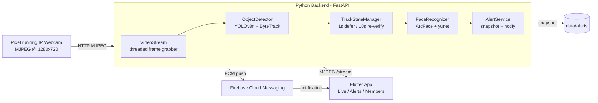

# Home Vision IDS — Development Journal (Learning Documentation Mode)

> **Purpose of this file.** This is a *teaching* journal, not API docs. It is detailed
> enough that, months from now, I could **delete the repository and rebuild the entire
> project from scratch using only this file.** It explains not just *what* was done but
> *why*, and *how I could write it myself from memory*.
>
> **How it is maintained.** After every completed milestone, this journal is updated
> *before* moving to the next task. It is a first-class project artifact.
>
> **How to read it.** Start at [Project Overview](#0-project-overview). Each phase follows
> the same 10-part template: Goal → Theory → Files → Step-by-step → Code Explanation →
> Common Mistakes → Key Takeaways → Rebuild Checklist. Skim the **Rebuild Checklist** at the
> end of each phase if you just want to *do it again*; read the **Theory** if you want to
> *understand it*.

---

## Table of Contents

- [0. Project Overview](#0-project-overview)
- [Progress Log](#progress-log)
- [Environment Setup (do this once)](#environment-setup-do-this-once)
- [Phase 1 — The Vision Engine](#phase-1--the-vision-engine)
- [Phase 1c-6 — Resolution & Distance Tuning](#phase-1c-6--resolution--distance-tuning)
- [Phase 2 — Backend API + Alert Pipeline](#phase-2--backend-api--alert-pipeline)
- [Phase 3 — The Flutter App](#phase-3--the-flutter-app)
- [Phase 4 — Firebase Push Notifications](#phase-4--firebase-push-notifications)
- [Appendix A — Master "Common Mistakes" List](#appendix-a--master-common-mistakes-list)
- [Appendix B — Command Reference](#appendix-b--command-reference)

---

## 0. Project Overview

**Home Vision IDS** (Intrusion Detection System) is an AI home-surveillance system. A phone
running the *IP Webcam* app acts as a camera. A Python backend pulls that video, detects
people with **YOLOv8n**, recognises known household members with **DeepFace/ArcFace**, and
when it sees an **unknown** person it saves a snapshot and sends a **push notification** to a
**Flutter** mobile app.

### System architecture



### Tech stack and *why*

| Layer | Choice | Why this and not the alternative |
|---|---|---|
| Detection | **YOLOv8n** (nano) | Runs 12–18 FPS on CPU. Larger variants (s/m/l) are more accurate but 3–5 FPS — unusable on an 8 GB laptop. Accuracy diff is negligible at home-surveillance scale. |
| Recognition | **DeepFace** w/ **ArcFace** backend | Pre-trained, 99.7% on LFW, no training needed. DeepFace wraps many models behind one API so backends are swappable. |
| Backend | **FastAPI + Uvicorn** | Native async — needed to stream MJPEG *and* run AI at once. Auto OpenAPI docs. Faster than Flask for I/O-bound work. |
| Streaming | **MJPEG over HTTP** | Simplest reliable video. No WebRTC signalling server. Works on LAN with sub-second latency. |
| Notifications | **Firebase FCM** | Free push delivery to Android/iOS; first-class Flutter support; simple `firebase-admin` Python SDK. |
| Mobile | **Flutter + Riverpod** | One codebase → Android + iOS. Riverpod = compile-safe, testable state management. |
| Config | **pydantic-settings + .env** | Typed config, no hard-coded secrets/paths. |

**Guiding principle:** *only pre-trained models*. The project is integration + optimisation,
not ML research — chosen because of the hardware constraint (Lenovo Yoga 7, 8 GB RAM).

### Repository structure (current)

```
home-vision-ids/
├── api/
│   ├── main.py                 # FastAPI app, lifespan starts the pipeline
│   ├── routes/                 # stream.py, alerts.py, members.py, devices.py
│   ├── services/pipeline.py    # VisionPipeline (the live loop, as a service)
│   └── schemas/alert.py        # Pydantic response models
├── engine/
│   ├── core/
│   │   ├── detector.py         # YOLOv8n + ByteTrack
│   │   ├── recognizer.py       # DeepFace/ArcFace + margin matching
│   │   ├── face_db.py          # local embeddings DB (.npy + .json)
│   │   ├── track_state.py      # per-track defer/re-verify state machine
│   │   ├── alerter.py          # SnapshotStore/Notifier interfaces + AlertService
│   │   ├── firebase_backends.py# Firebase impls of those interfaces
│   │   └── device_tokens.py    # file-backed FCM token registry
│   └── utils/stream.py         # threaded MJPEG reader
├── config/
│   ├── settings.py             # pydantic-settings
│   └── tracker/bytetrack_custom.yaml
├── scripts/                    # enroll_face.py, capture_enrollment_frames.py, test_*.py
├── data/                       # faces/ embeddings/ alerts/ logs/ (all gitignored)
├── app/                        # Flutter project (separate Dart app)
└── docs/development_journal.md # ← this file
```

---

## Progress Log

| Date | Milestone |
|---|---|
| 2026-06-19 | Project scaffolded (FastAPI skeleton, settings, repo structure). |
| 2026-06-20→24 | Phase 1 vision engine: detection, tracking, face DB, recognizer, track-state, enrollment tools. |
| 2026-06-24 | **Phase 1c complete.** Margin-based recognizer added (the code had been written before but never committed). 720p resolution bump (Phase 1c-6). |
| 2026-06-24 | **Phase 2 complete.** Pipeline extracted into a service; `/stream`, `/alerts`, `/members` routes; local-first alert pipeline behind a swappable interface. Proven live (stream 200 OK). |
| 2026-06-24 | Tuning: enrollment 12→24 shots + distance poses; `MIN_PERSON_BOX_HEIGHT` made a setting; `requirements.txt` opencv fix. |
| 2026-06-24 | **Phase 3 complete.** Flutter app scaffolded (Riverpod, 4 screens, custom MJPEG widget); ran on a real Pixel 4a; live stream confirmed. |
| 2026-06-26 | **Phase 4 complete.** Firebase FCM push wired end to end; verified live — a stranger in front of the camera produces a real push alert with sound on the phone. |
| 2026-06-26 | This learning journal created. |
| 2026-06-26 | **Phase 6 investigated.** Re-enrolled (24→32 shots), then refactored enrollment to mirror the runtime pipeline (shared crop + embedding). A decisive live A/B (real joshua vs stranger, side by side) proved strangers and the household occupy the **same** embedding range (stranger best-match 0.182 < real joshua's worst 0.35). Conclusion: recognition accuracy is a **fundamental limit** at this camera quality — accepted and documented. The refactor was kept (it fixed a real enroll-vs-runtime mismatch). |
| 2026-06-27 | **Phase 5 — remote access.** An ngrok tunnel exposes the backend at a public HTTPS URL so the app reaches the stream + REST from anywhere. App sends `ngrok-skip-browser-warning` on every request so the free tier serves real responses, not its HTML interstitial. (Alerts already worked remotely — FCM is cloud-based.) |
| 2026-06-26 | **Phase 6b — temporal-consistency voting.** Since single frames can't be trusted but real members are steady while strangers oscillate, recognition now votes over a rolling 5-frame window (commit a name only at ≥4/5 agreement; default to stranger otherwise). Unit-tested against the real A/B vote sequence: the stranger's oscillation (incl. the 0.182 false match) now resolves to *stranger*. Mitigates the limit without fixing the unfixable embeddings. |

---

## Environment Setup (do this once)

### 1. Goal
Get a machine able to run the backend (Python) and build the app (Flutter).

### 2. Theory
We isolate Python dependencies in a **virtual environment** (`venv`) so the heavy CV/ML
libraries don't pollute the system Python. Secrets and machine-specific values live in a
`.env` file (never committed); `.env.example` documents what variables are required.

### 3. Step-by-Step
```bash
# Python 3.11+ and a venv
python -m venv venv
venv\Scripts\activate          # Windows PowerShell: venv\Scripts\Activate.ps1
pip install -r requirements.txt

# Create your .env from the template, then edit values
copy .env.example .env         # (cp on mac/linux)
```

Key `.env` values:
```ini
CAMERA_URL=http://192.168.1.121:8080/video   # from the IP Webcam app
STREAM_WIDTH=1280
STREAM_HEIGHT=720
CONFIDENCE_THRESHOLD=0.60
MIN_PERSON_BOX_HEIGHT=120
FIREBASE_CREDENTIALS_PATH=config/firebase-credentials.json
FIREBASE_STORAGE_BUCKET=your-app.appspot.com   # placeholder = Storage off
```

For the app: install the **Flutter SDK** (e.g. `C:\flutter`, add `C:\flutter\bin` to PATH)
and **Android Studio** (gives the Android SDK + an emulator). Verify with `flutter doctor`.

### 4. Manual Rebuild Checklist
- [ ] Install Python 3.11+, create & activate `venv`
- [ ] `pip install -r requirements.txt`
- [ ] Copy `.env.example` → `.env`, fill in `CAMERA_URL`
- [ ] Install Flutter SDK + Android Studio, `flutter doctor` green for Android
- [ ] Install the **IP Webcam** app on a phone; note its `http://<ip>:8080/video` URL

---

## Phase 1 — The Vision Engine

### 1. Goal
Turn a camera stream into a labelled feed: detect people, track them across frames, and
recognise known faces — all on CPU, in real time.

### 2. Theory

**Why a threaded frame grabber?** `cv2.VideoCapture.read()` blocks until the next frame.
If the AI loop is slow, frames queue up and you process *stale* video. Solution: a background
thread continuously reads and keeps only the **latest** frame; the AI loop always grabs the
freshest one. (See `engine/utils/stream.py`.)

**Why tracking, not just detection?** Detection alone gives boxes per frame with no identity
continuity. **ByteTrack** assigns a stable `track_id` to each person across frames. That lets
us (a) avoid re-running expensive face recognition every frame, and (b) attach a recognition
*result* to a person over time.

**Why defer recognition (the "1-second rule")?** DeepFace is ~300 ms/call. Running it every
frame drops us to 3–5 FPS and wastes work on people who just pass the frame edge. So we only
recognise a track after it's been **continuously visible ≥ 1 s**. (See `track_state.py`.)

**Why periodic re-verification?** ByteTrack can swap two people's IDs when they cross. So even
after a track is recognised, we re-run recognition every **10 s** to catch and fix swaps.

**Why store one embedding per enrolled photo (not an average)?** Averaging multiple poses into
one vector creates a centroid that may match *no* real pose well. Keeping each photo's
embedding as its own row gives the recogniser multiple reference points (angles/lighting).

**Why margin matching?** ArcFace returns a distance to the nearest known face. If we accept any
match below a threshold, a stranger whose face happens to be *slightly* closer to "joshua" than
to "noela" gets mislabelled. Margin matching adds: *the nearest match must also be clearly
closer than the nearest person of a different identity* (`MIN_CONFIDENCE_MARGIN`). Otherwise we
return `uncertain` and don't commit a name.

### 3. Files Created or Modified
| File | Responsibility | Interacts with |
|---|---|---|
| `config/settings.py` | Typed config from `.env` (camera, thresholds, paths). | Imported everywhere as `settings`. |
| `engine/utils/stream.py` | `VideoStream` — threaded latest-frame reader, auto-reconnect. | Feeds `detector`. |
| `engine/core/detector.py` | `ObjectDetector` — YOLOv8n `.track()`, returns boxes + `track_id`. | Uses `bytetrack_custom.yaml`; output → pipeline. |
| `config/tracker/bytetrack_custom.yaml` | ByteTrack config; `track_buffer=90` (~6 s) for re-entry. | Loaded by detector. |
| `engine/core/face_db.py` | `FaceDatabase` — loads/saves `.npy` embeddings + `.json` metadata. | Used by recognizer + enrollment. |
| `engine/core/recognizer.py` | `FaceRecognizer` — embed a crop, cosine match + margin. | Reads `face_db`. |
| `engine/core/track_state.py` | `TrackStateManager` — when to recognise each track. | Orchestrated by the pipeline. |
| `scripts/enroll_face.py` | Build embeddings from `data/faces/<name>/`. | Writes via `face_db`. |
| `scripts/capture_enrollment_frames.py` | Guided live capture (poses) → auto-enroll. | Calls `enroll_face`. |

### 4. Step-by-Step Implementation
1. Write `config/settings.py` with `pydantic-settings`; load from `.env`.
2. Write `engine/utils/stream.py` (threaded reader).
3. `engine/core/detector.py`: load `YOLO('yolov8n.pt')`, call `model.track(..., persist=True,
   tracker=bytetrack_custom.yaml)`, filter to `TARGET_CLASSES` (person, cat, dog, bags).
4. `engine/core/face_db.py`: `np.save`/`np.load` for embeddings, parallel JSON for names.
5. `engine/core/recognizer.py`: `DeepFace.represent(crop, model_name='ArcFace',
   detector_backend='yunet')`, cosine distance, threshold `0.52`, margin `0.08`.
6. `engine/core/track_state.py`: dataclass per track; `should_recognize()` enforces the 1 s
   defer + 10 s re-verify; `update_result()` stores the outcome.
7. Enrollment: `capture_enrollment_frames.py <name>` walks through poses and calls
   `enroll_face.py`, which uses the heavier `retinaface` backend (offline = accuracy ok).

### 5. Code Explanation (teach the key block)

The recogniser's margin logic — the heart of accuracy:
```python
# recognizer.py (conceptual)
name, distance, margin = self._best_match(query_embedding)
if distance < MATCH_THRESHOLD and margin >= MIN_CONFIDENCE_MARGIN:
    return {"status": "recognized", "name": name, "distance": distance}
elif distance < MATCH_THRESHOLD:        # close, but ambiguous between two people
    return {"status": "uncertain", "name": None, "distance": distance}
return {"status": "unrecognized", "name": None, "distance": distance}
```
*How to write it from memory:* normalise both vectors, compute cosine **distance** = `1 - cos`.
`_best_match` returns the closest row's name + distance, **and** the distance to the closest row
belonging to a *different* person (the margin). Recognise only when you're both close enough
*and* the runner-up identity is clearly further away.

The two timing constants that encode the design decisions:
```python
CONFIRM_SECONDS = 1.0    # defer recognition until a track is this old
REVERIFY_SECONDS = 10.0  # re-run recognition this often to catch ID swaps
```

### 6. Common Mistakes
- **The margin recognizer wasn't actually in the repo.** A commit message claimed
  "margin-based matching" but the file only had a plain `argmin`. Lesson: a commit *message*
  is not proof; `git show HEAD:file` to verify what's really committed.
- **`opencv` backend choice for live recognition.** `opencv` (Haar) gave confidently-wrong
  matches; `mediapipe` hit an upstream bug; settled on **`yunet`** (OpenCV's CNN detector) —
  fast, better alignment, no broken deps.

### 7. Key Takeaways
- Track first, recognise sparingly. Continuity (`track_id`) is what makes expensive AI cheap.
- Recognition accuracy is dominated by *enrollment conditions matching runtime conditions*.

### 8. Manual Rebuild Checklist
- [ ] `settings.py` loads `.env`
- [ ] `VideoStream` returns the latest frame on a thread
- [ ] `detector.track()` returns `{label, bbox, confidence, track_id}`
- [ ] `face_db` round-trips `.npy` + `.json`
- [ ] `recognizer` returns recognized/uncertain/unrecognized with margin
- [ ] `track_state` defers 1 s, re-verifies 10 s
- [ ] Enroll someone: `python scripts/capture_enrollment_frames.py <name>`

---

## Phase 1c-6 — Resolution & Distance Tuning

### 1. Goal
Improve recognition by feeding ArcFace more facial detail, and make detection range tunable
for a top-corner camera.

### 2. Theory
ArcFace is sensitive to camera characteristics (compression, optics). At 640×480 too much
facial detail is lost, causing the "confuses enrolled people" bug. Bumping to **720p
(1280×720)** gives more pixels per face. Separately, `MIN_PERSON_BOX_HEIGHT` gates *when* a
person is close enough to bother recognising — lower = recognise people further away (good for
a corner-mounted camera), at the cost of less reliable embeddings.

### 3. Files Modified
- `config/settings.py`, `.env`, `.env.example`: `STREAM_WIDTH/HEIGHT` → 1280/720; new
  `MIN_PERSON_BOX_HEIGHT=120`.
- `scripts/capture_enrollment_frames.py`: 6→8 poses, 2→3 shots (`--shots N`), added **distance**
  and **look-up** poses (match what a top-corner camera sees).
- `requirements.txt`: `opencv-python-headless` → `opencv-python` (see mistakes).

### 6. Common Mistakes
- **Three `cv2` installs.** `opencv-python-headless` (our pin) + `opencv-python` (pulled by
  ultralytics) + `opencv-contrib-python` (pulled by a mediapipe experiment) all share the `cv2`
  namespace. The headless build has no GUI, breaking the `imshow`-based enrollment scripts. Fix:
  depend on **`opencv-python`** only; a fresh `pip install -r requirements.txt` then resolves to
  one GUI-capable build.
- **A hard-coded `MIN_PERSON_BOX_HEIGHT` in two files** would drift. Moved it to `settings` so
  the live pipeline and the debug script read the same value.

### 8. Manual Rebuild Checklist
- [ ] Set IP Webcam to 1280×720, quality ~80%
- [ ] `.env` STREAM_WIDTH/HEIGHT = 1280/720
- [ ] Re-enroll everyone from the *new* stream
- [ ] `requirements.txt` uses `opencv-python` (not headless)

---

## Phase 2 — Backend API + Alert Pipeline

### 1. Goal
Expose the vision engine over HTTP: a live MJPEG stream, an alerts feed, a members roster — and
turn "unknown person confirmed" into a saved snapshot + a (stubbed-then-real) notification.

### 2. Theory

**Why move the loop into a service?** The Phase 1 loop lived in a test script with `cv2.imshow`.
A server can't pop windows and must load the heavy models **once** (not per request). So the loop
becomes `VisionPipeline`, built once at app startup (FastAPI **lifespan**) and run on a background
thread; routes read its latest annotated frame / alerts.

**Why an interface (`SnapshotStore` / `Notifier`) for alerts?** We wanted to ship *now* (local
only) but swap in Firebase *later* with one change, not a refactor. So the alert pipeline depends
on two **abstract base classes**; today it uses `LocalSnapshotStore` (writes JPEGs to
`data/alerts/`) + `StubNotifier` (logs "would send FCM"). A factory `build_alert_service()` is the
single swap point.

**Why MJPEG via `StreamingResponse`?** `multipart/x-mixed-replace` repeatedly pushes JPEG frames
over one HTTP response — trivially consumable and debuggable.

### 3. Files Created
| File | Responsibility |
|---|---|
| `api/main.py` | FastAPI app; lifespan builds+starts the pipeline; mounts routers; CORS. |
| `api/services/pipeline.py` | `VisionPipeline` — owns stream/detector/recognizer/track_state/threadpool/alerter; background loop; `get_jpeg()`; `build_pipeline()`/`get_pipeline()` singleton. |
| `engine/core/alerter.py` | `Alert` dataclass; `SnapshotStore`/`Notifier` ABCs; `LocalSnapshotStore`; `StubNotifier`; `AlertService` (per-track 60 s cooldown, recent-ring buffer); `build_alert_service()`. |
| `api/routes/stream.py` | `GET /stream` → MJPEG. |
| `api/routes/alerts.py` | `GET /alerts`, `GET /alerts/{id}/snapshot`. |
| `api/routes/members.py` | `GET /members` (roster from the face DB). |
| `api/schemas/alert.py` | `AlertOut`, `AlertListOut`, `MemberOut`, `MemberListOut`. |

### 4. Step-by-Step
1. `pipeline.py`: a class holding the engine objects + a `ThreadPoolExecutor(1)` for recognition;
   a `run()` loop that reads a frame, `detector.track()`, updates `track_state`, submits
   recognition when due, draws labels, encodes the latest JPEG, and calls
   `alerter.handle_unknown(...)` when a track is confirmed a stranger.
2. `main.py` lifespan: `pipeline = build_pipeline(); pipeline.start()` inside `try/except` so a
   missing camera **does not** crash the API (it logs and `/stream` returns 503).
3. Routes: uncomment routers; MJPEG generator yields `--frame` boundaries + JPEG bytes.

### 5. Code Explanation
The graceful-degradation lifespan (so a dead camera never takes down the API):
```python
pipeline = build_pipeline()
try:
    pipeline.start()                 # connects to the camera
except Exception as e:
    logger.error(f"Pipeline failed to start (camera?): {e}")
yield                                # API still serves /members, /devices, etc.
```
*Why:* the camera is the flakiest dependency. The API must come up regardless so token
registration and the roster still work; only the live features degrade.

### 6. Common Mistakes
- **Recogniser instantiated per request = cold start every time** (TF + ArcFace load = seconds).
  Fixed by building the pipeline **once** in lifespan and reusing it (the singleton).
- **Cooldown identity.** A stranger has no stable identity, so the 60 s alert cooldown is keyed on
  `track_id` — one alert per continuous sighting.

### 7. Key Takeaways
- Load heavy models once; share them. Lifespan is the place.
- Program to interfaces when you know a dependency (Firebase) is coming but isn't ready.

### 8. Manual Rebuild Checklist
- [ ] `VisionPipeline` runs the loop on a thread, exposes `get_jpeg()` + an alerter
- [ ] `build_alert_service()` returns Local + Stub when no Firebase
- [ ] lifespan builds+starts the pipeline, tolerates a missing camera
- [ ] `/stream` (MJPEG), `/alerts`, `/members` mounted
- [ ] `python -m api.main` → visit `http://localhost:8000/docs`

---

## Phase 3 — The Flutter App

### 1. Goal
A phone app that shows the live feed, lists alerts + members, and (Phase 4) receives push.

### 2. Theory

**Why a thin client?** The backend already burns boxes/labels into the MJPEG and owns all data.
The app mostly *displays*. No CV on the phone.

**Why Riverpod (v3)?** Compile-safe, testable state with little boilerplate. We use the modern
`Notifier`/`NotifierProvider`/`FutureProvider` (in v3 the old `StateProvider`/`StateNotifier` are
"legacy").

**Why a *custom* MJPEG widget?** Flutter's `Image.network` loads a **single** image — it cannot
follow a `multipart/x-mixed-replace` stream. The `flutter_mjpeg` package *can*, but it pins
`http <1.0.0`, conflicting with the `http ^1.6.0` the rest of the app uses. So we wrote
`MjpegView`: open a streaming GET, scan the byte stream for JPEG markers (`FFD8`…`FFD9`), and swap
each complete frame into an `Image.memory(gaplessPlayback: true)`.

**Why a configurable backend URL?** A phone can never reach the laptop's `localhost`. It needs the
laptop's **LAN IP** (same WiFi) or an ngrok URL (remote). Stored in `shared_preferences`, editable
in Settings, defaulted to the dev machine's LAN IP so first launch "just works".

### 3. Files Created
```
app/lib/
├── main.dart                       # ProviderScope + SharedPreferences override + MaterialApp
└── src/
    ├── config/config.dart          # sharedPreferencesProvider, backendUrlProvider (Notifier)
    ├── models/{alert,member}.dart   # fromJson mirrors of the API schemas
    ├── services/
    │   ├── api_client.dart          # http GETs: alerts, members, streamUrl, registerDevice
    │   └── providers.dart           # apiClientProvider, alertsProvider, membersProvider
    ├── widgets/mjpeg_view.dart      # custom MJPEG renderer
    └── screens/
        ├── home_shell.dart          # bottom-nav (Live/Alerts/Members/Settings)
        ├── live_view_screen.dart    # MjpegView
        ├── alerts_screen.dart       # alert cards + snapshot thumbnails
        ├── members_screen.dart      # roster
        ├── settings_screen.dart     # backend URL + "test connection"
        └── widgets/async_views.dart # shared error/empty states
```

### 4. Step-by-Step
```bash
flutter create --org com.homevision --project-name home_vision_ids --platforms android,ios app
cd app
flutter pub add flutter_riverpod http shared_preferences
```
Then write the `lib/` tree above. Edit `android/app/src/main/AndroidManifest.xml`:
```xml
<uses-permission android:name="android.permission.INTERNET"/>
<application ... android:usesCleartextTraffic="true">
```
(`usesCleartextTraffic` is required because the LAN backend is plain `http`, which Android blocks
by default.) Build/run on a phone:
```bash
flutter run -d <deviceId>
```

### 5. Code Explanation
The MJPEG frame extractor (write-from-memory recipe):
```dart
// Accumulate bytes; a JPEG starts with FF D8 (SOI) and ends with FF D9 (EOI).
_buffer.addAll(chunk);
final start = _find(0xD8);            // FF D8
final end   = _find(0xD9, start+2);   // FF D9
if (start >= 0 && end >= 0) {
  final frame = Uint8List.fromList(_buffer.sublist(start, end+2));
  _buffer.removeRange(0, end+2);
  setState(() => _frame = frame);     // Image.memory(_frame, gaplessPlayback: true)
}
```

### 6. Common Mistakes
- **`flutter create` overwrote nothing useful but generated a counter demo + a test referencing
  `MyApp`.** Replaced `main.dart` and the widget test (the default test fails to compile once
  `MyApp` is gone).
- **`flutter_mjpeg` version conflict** (`http <1.0.0`). Chose a 60-line custom widget over
  downgrading a core dep.
- **First Android build ≈ 16 minutes** — it downloads the NDK (~1 GB) + CMake once. Not a hang.
  Later builds are seconds.
- **Wireless `adb` drops when the phone sleeps** ("Lost connection to device"). The app stays
  installed and keeps running; reconnect via Android Studio → Device Manager → *Pair using Wi-Fi*.

### 7. Key Takeaways
- Know your widget's limits (`Image.network` ≠ video). Verify a package's constraints before
  adopting it.
- A configurable base URL is the difference between "works on my emulator" and "works on a phone".

### 8. Manual Rebuild Checklist
- [ ] `flutter create ... app`; `flutter pub add flutter_riverpod http shared_preferences`
- [ ] Manifest: INTERNET + `usesCleartextTraffic="true"`
- [ ] `MjpegView` renders the `/stream`
- [ ] Backend URL stored in `shared_preferences`, default = laptop LAN IP
- [ ] `flutter run -d <phone>`; same WiFi as the backend

---

## Phase 4 — Firebase Push Notifications

### 1. Goal
When the backend confirms a stranger, the phone gets a real push notification (with sound), even
when the app is closed.

### 2. Theory

**FCM in one picture:** the backend (with a Firebase **service-account** key) tells **Firebase
Cloud Messaging** "send this to device token X"; FCM delivers it to the phone. The app gets its
**device token** from `firebase_messaging` and registers it with the backend.

**Why Storage is optional here.** Firebase Storage (for snapshot images) now requires the paid
**Blaze** plan for new projects. **FCM is free.** So we run in a mixed mode: snapshots stay
**local** (served by the backend at `/alerts/<id>/snapshot`) and only the **push** goes through
Firebase. The same interface supports upgrading to cloud Storage later.

**Android notification channels.** On Android 8+, a notification's sound/heads-up behaviour comes
from its **channel's importance**, set at channel creation and **immutable** afterwards. For a
heads-up banner + sound you need an `IMPORTANCE_HIGH` channel that exists *before* the
notification arrives.

### 3. Files Created / Modified
| File | Responsibility |
|---|---|
| `engine/core/firebase_backends.py` | `init_firebase()`, `FirebaseSnapshotStore` (Storage upload → signed URL), `FcmNotifier` (send_each + AndroidConfig channel/sound/priority). Only module importing `firebase_admin`. |
| `engine/core/device_tokens.py` | File-backed FCM token registry shared by API + notifier. |
| `api/routes/devices.py` | `POST /devices` — app registers its token. |
| `engine/core/alerter.py` | `build_alert_service()` now picks backends by what's configured (3 modes). |
| `app/.../MainActivity.kt` | **Natively** creates the high-importance channel (the fix). |
| `app/lib/src/services/push_service.dart` | Permission, token→`/devices`, foreground/tap handling, local notifications. |
| `app/lib/src/state/selected_tab.dart` | Tab index as a provider so a push tap jumps to Alerts. |

### 4. Step-by-Step

**4.1 — Firebase console (manual):**
1. Create project `home-vision-ids`; disable Analytics.
2. Add an **Android app**, package `com.homevision.home_vision_ids`; download
   `google-services.json` → `app/android/app/`.
3. Project settings → Service accounts → **Generate new private key** →
   `config/firebase-credentials.json`.
4. (Storage skipped — would require Blaze.)

**4.2 — Backend:** implement `firebase_backends.py` + `device_tokens.py` + `/devices`; make
`build_alert_service()` choose: *creds+bucket* → Storage+FCM; *creds only* → **local snapshots +
FCM** (our case); *no creds* → local + stub.

**4.3 — App:**
```bash
cd app
flutter pub add firebase_core firebase_messaging flutter_local_notifications
```
Gradle: add the `com.google.gms.google-services` plugin (in `settings.gradle.kts` and
`app/build.gradle.kts`), `minSdk = 23`, and **core library desugaring** (for
`flutter_local_notifications`). Manifest: `POST_NOTIFICATIONS` permission + the FCM default
channel meta-data. Dart: `Firebase.initializeApp()` in `main`, a background handler, and
`PushService` (token registration + notification handling).

**4.4 — Live test:** start IP Webcam → start backend → walk in as a stranger → push arrives.

### 5. Code Explanation
The factory that makes Firebase a *configuration*, not a code change:
```python
def build_alert_service():
    if _credentials_present():
        init_firebase()
        notifier = FcmNotifier()
        store = FirebaseSnapshotStore() if _storage_configured() else LocalSnapshotStore()
        return AlertService(store=store, notifier=notifier)
    return AlertService(store=LocalSnapshotStore(), notifier=StubNotifier())
```
The **native** channel creation (Kotlin) — what finally made notifications audible:
```kotlin
val channel = NotificationChannel("high_importance_alerts", "Security Alerts",
                                  NotificationManager.IMPORTANCE_HIGH)
channel.enableVibration(true)
getSystemService(NotificationManager::class.java).createNotificationChannel(channel)
```

### 6. Common Mistakes (this phase had the most — read carefully)
- **Service-account file saved as `firebase-credentials.json .json`** (a stray ` .json`). The
  setting looked for the exact name → `_credentials_present()` was `False`. Always verify the
  filename, not just "it's in the folder".
- **`flutter_local_notifications` 22.x changed its API to all-named params:** `initialize(settings:
  ...)` and `show(id:, notificationDetails:)`. The old positional calls don't compile. Read the
  installed package's signatures instead of trusting memory.
- **It also requires core library desugaring** (`isCoreLibraryDesugaringEnabled = true` +
  `coreLibraryDesugaring("com.android.tools:desugar_jdk_libs:2.1.4")`), else the build fails.
- **THE BIG ONE — silent notifications.** `flutter_local_notifications`'
  `createNotificationChannel` silently **no-op'd** (its Android resolver returned null), so the
  high-importance channel was never created; background FCM fell back to a default low channel =
  silent. **Fix:** create the channel **natively in `MainActivity.onCreate`**. Verified with
  `adb shell dumpsys notification` that the channel then existed at `mImportance=4`.
- **Still silent after that — a device setting.** The phone's *default notification sound* was set
  to **"None"**, silencing all apps. (And vibration/screen-wake are device settings too.) Lesson:
  when the channel is provably correct, suspect the device (`adb shell settings get system
  notification_sound`, `... global zen_mode`, `dumpsys audio`).

### 7. Key Takeaways
- For Android background notifications, the **channel must pre-exist** and be high-importance;
  create it natively to be sure.
- "Sent: 1, failed: 0" from FCM only means *delivered to the device* — sound/vibration/wake are
  gated by **channel importance + device settings**, not by your send call.
- Diagnose the device empirically with `adb shell dumpsys ...` rather than guessing.

### 8. Manual Rebuild Checklist
- [ ] Firebase project + Android app registered; `google-services.json` in `app/android/app/`
- [ ] Service-account key at `config/firebase-credentials.json` (exact name!)
- [ ] Backend: `firebase_backends.py`, `device_tokens.py`, `POST /devices`, 3-mode factory
- [ ] App deps: `firebase_core`, `firebase_messaging`, `flutter_local_notifications`
- [ ] Gradle: google-services plugin, `minSdk 23`, desugaring
- [ ] Manifest: `POST_NOTIFICATIONS` + default-channel meta-data
- [ ] **Native** high-importance channel in `MainActivity`
- [ ] `Firebase.initializeApp()` + background handler in `main`
- [ ] `PushService`: permission → token → `POST /devices` → handle messages
- [ ] Live test: IP Webcam → backend → walk in as stranger → phone buzzes

---

## Phase 5 — Remote Access (beyond the LAN)

### 1. Goal
Let the app reach the backend (live stream + REST data) from **anywhere**, not just on home WiFi.

### 2. Theory
The phone reaches the backend by IP. On the LAN that's the laptop's `192.168.x.x`, which is
**private** — unreachable from the internet. Three ways to fix it: (a) **port-forward** the
router (fragile, exposes your network, needs a static IP/DDNS); (b) **deploy** the backend to a
cloud VPS (overkill, and the camera is on the home LAN); (c) a **reverse tunnel** — a local agent
dials *out* to a public relay that forwards traffic back. (c) is the right tradeoff: no router
config, no inbound firewall holes, HTTPS for free. **ngrok** is the canonical tool.

Important realisation: **alerts already work remotely.** FCM push is delivered by Google's cloud,
independent of your LAN — so only the *pull* features (stream, alerts list, members, snapshots)
needed the tunnel.

### 3. Files Modified
| File | Change |
|---|---|
| `app/lib/src/services/api_client.dart` | New `kBackendHeaders` (`ngrok-skip-browser-warning: true`); sent on every REST call. |
| `app/lib/src/widgets/mjpeg_view.dart` | Sends the header on the MJPEG stream request. |
| `app/lib/src/screens/alerts_screen.dart` | Sends the header on snapshot `Image.network` loads. |

### 4. Step-by-Step
1. `ngrok config add-authtoken <token>` (one-time; token from the ngrok dashboard).
2. Start the backend: `python -m api.main`.
3. `ngrok http 8000` → note the public `https://<random>.ngrok-free.dev` URL.
4. App → **Settings** → set Backend URL to that public URL → Save.
5. Test from the phone, ideally on **mobile data** (truly off-LAN).

### 5. Code Explanation
```dart
// One header object, sent on REST, the MJPEG stream, AND snapshot images:
const kBackendHeaders = {'ngrok-skip-browser-warning': 'true'};
http.get(uri, headers: kBackendHeaders);                 // REST
request.headers.addAll(kBackendHeaders);                 // MJPEG stream (http.Request)
Image.network(url, headers: kBackendHeaders);            // snapshot images
```
*Why:* ngrok's free tier intercepts "browser-like" requests with a one-time HTML warning page. A
request carrying this header is treated as a programmatic client and passed straight through. The
header is meaningless to a direct-LAN backend, so it's safe to always send.

### 6. Common Mistakes
- **Forgetting the header on images/stream, not just REST.** The JSON worked but snapshots and the
  live feed silently broke, because `Image.network` and the MJPEG request weren't sending it.
- **Assuming the free URL is stable.** ngrok-free gives a *new random* URL each run — set it in the
  app each session, or claim the one free **static domain** on your ngrok account for a fixed URL.

### 7. Key Takeaways
- A reverse tunnel is the least-effort way to expose a home service safely.
- Separate *push* (works anywhere via FCM) from *pull* (needs reachability) — only the latter needs
  the tunnel.

### 8. Manual Rebuild Checklist
- [ ] `kBackendHeaders` sent on REST, MJPEG, and snapshot image requests
- [ ] ngrok authenticated; `ngrok http 8000` gives a public HTTPS URL
- [ ] Public URL returns JSON (not the ngrok HTML page) when the header is sent
- [ ] App Settings → Backend URL = public URL; test on mobile data

---

## Phase 6 — Recognition Accuracy: a Fundamental Limit

### 1. Goal
Fix the symptom seen live in Phase 4.4: an unenrolled **stranger** being recognised as a
household member (joshua) — a false positive that's serious for a security system.

### 2. Theory
ArcFace maps a face to a 512-D vector; we match by **cosine distance** to enrolled vectors.
This only works if two different people's vectors are **farther apart** than the same person's
vectors across frames. With a compressed phone-camera stream (and people who genuinely resemble
each other), the embeddings of different people can **collapse together** — at which point *no*
threshold separates them, because the separation simply isn't there in the data.

Two hypotheses were tested and rejected:
1. **Not enough/representative enrollment** → re-enrolled at 32 shots with distance + look-up
   poses. Did **not** fix it.
2. **Enroll-vs-runtime pipeline mismatch** → enrollment used `retinaface` on full frames while
   runtime used `yunet` on person-crops; different alignment ⇒ different embedding space. We made
   both use the **same** path. A genuine architectural fix — but it did **not** fix the accuracy.

### 3. Files Modified (the refactor — worth keeping regardless)
| File | Change |
|---|---|
| `engine/utils/face_crop.py` (new) | Single source of truth for the person→face crop (`FACE_CROP_RATIO`, `extract_face_crop`). |
| `engine/core/recognizer.py` | New `extract_embedding(crop)` — the ONE embedding code path; `recognize()` uses it. |
| `engine/core/detector.py` | Implemented `detect()` (detection without tracking) for enrollment. |
| `scripts/enroll_face.py` | Rebuilt to enroll through the runtime path: frame → YOLO crop → yunet → ArcFace. |
| `api/services/pipeline.py` | Uses the shared `extract_face_crop` (so runtime ≡ enrollment crop). |

### 4. Step-by-Step
1. Add `face_crop.py`; route both `pipeline` and `enroll_face` through it.
2. Add `extract_embedding()`; route both `recognize()` and `enroll_face` through it.
3. `python scripts/enroll_face.py --all` → rebuild embeddings from existing photos (no re-capture).
4. **Decisive live A/B:** real joshua AND the stranger in frame together; read per-track distances.

### 5. Code Explanation (the experiment that gave the answer)
The whole point of the refactor in one idea: *enrol and recognise through identical code*, so a
person's enrolled vectors and live vectors are comparable:
```python
# BOTH enroll_face.py and recognizer.recognize() now call:
emb = extract_embedding(extract_face_crop(frame, person_bbox))   # YOLO crop → yunet → ArcFace
```
The measurement that settled it (real vs stranger, same DB, same moment):
```
real joshua : 0.20, 0.23, 0.25, 0.27, 0.30, 0.32, 0.35
stranger    : 0.18(!), 0.41, 0.43, 0.53, 0.57, 0.59, 0.62
```
The stranger's **0.18** is below joshua's worst (**0.35**) → the distributions overlap → unseparable.

### 6. Common Mistakes / Pitfalls
- **Testing a recogniser on full frames vs. crops gives opposite results.** Feeding full 720p
  frames to `yunet` returned "NO FACE" everywhere; feeding YOLO **person-crops** recognised fine.
  Always test through the *same* input transform production uses.
- **A single confident false match (0.18) means no threshold can help.** Don't chase threshold
  tuning once you've seen the stranger dip *below* the real person's range.
- **Parsing wrapped, ANSI-coloured, UTF-16 logs is painful.** Reconstruct records by splitting on
  the timestamp and collapsing whitespace (see Appendix B) — or log to a file sink without colour.

### 7. Key Takeaways
- Face recognition quality is bounded by **camera quality and inter-person similarity** — beyond a
  point, neither more data nor better thresholds help. Know when a problem is *data-limited*.
- A negative result, proven rigorously (side-by-side A/B), is a real result — it tells you to stop
  digging and **design around** the limit instead of fighting it.
- **Design around it:** the system stays useful because the 10 s re-verification + "alert on any
  >0.52 frame" make it **err toward alerting**. Future mitigations (not yet built): require
  *temporal consistency* (a stranger's distance oscillates; a real member's is steady), a better
  camera, or a second factor.

### 8. Manual Rebuild Checklist
- [ ] `face_crop.py` shared by `pipeline` + `enroll_face`
- [ ] `extract_embedding()` shared by `recognize()` + `enroll_face`
- [ ] `detector.detect()` implemented
- [ ] `enroll_face.py` enrolls through YOLO-crop → yunet → ArcFace
- [ ] `enroll_face.py --all`; restart backend
- [ ] Accept that recognition is imperfect at this camera quality; rely on the alert safety net

---

## Phase 6b — Temporal-Consistency Voting (designing around the limit)

### 1. Goal
Given that single-frame recognition is unreliable (Phase 6), stop a stranger from *ever* being
labelled a household member from one lucky frame — without needing to separate the embeddings
(which we proved we can't).

### 2. Theory
The Phase 6 A/B data revealed the lever: a **real member's distance is steady** across frames
(joshua ~0.20–0.35 every time) while a **stranger's oscillates** wildly (0.18 → 0.62, flipping
between names and "unrecognized"). So instead of trusting one frame, accumulate recent
recognitions as **votes** and require a **strong majority** before committing an identity. A
track that never reaches a confident known majority is treated as a **stranger** — the
security-safe default ("can't consistently recognise you ⇒ unknown"). This is a classic
*temporal smoothing / majority-vote* technique; it converts noisy per-frame predictions into a
stable decision.

### 3. Files Modified
| File | Change |
|---|---|
| `engine/core/track_state.py` | `TrackEntry` gains a `votes` deque + `confirmed` flag. `update_result()` records a vote and tallies the window instead of committing on one frame. New `_tally()`. New constants `VOTE_WINDOW=5`, `VOTE_MIN_AGREE=4`. |

### 4. Step-by-Step
1. Each recognition result becomes a vote token: a **name** (recognized), `_STRANGER`
   (unrecognized), or `_UNCERTAIN`; `no_face` is not a vote.
2. Push it into a `deque(maxlen=5)`.
3. `_tally`: if any **name** has ≥ 4 of the 5 → `recognized`; else if the window is full (5) with
   no such majority → `unrecognized` (stranger); else → `pending` (keep gathering).
4. While `pending`, leave `last_verified = 0` so `should_recognize()` fires rapidly (votes gather
   in ~1–2 s); once decided, set `last_verified = now` to drop back to the 10 s re-verify cadence.

### 5. Code Explanation
```python
def _tally(votes):
    window = list(votes)
    names = Counter(v for v in window if v not in (_STRANGER, _UNCERTAIN))
    if names and names.most_common(1)[0][1] >= VOTE_MIN_AGREE:
        return ("recognized", names.most_common(1)[0][0])
    if len(window) >= VOTE_WINDOW:
        return ("unrecognized", None)   # full window, no confident known ⇒ stranger
    return ("pending", None)
```
*Write-from-memory recipe:* keep a fixed-size deque of the last N predictions; count the names
(ignore the not-a-known tokens); if one name dominates, commit it; if the window is full and none
dominates, it's a stranger; otherwise wait for more.

### 6. Common Mistakes / Pitfalls
- **Tuning the majority too low.** At 3/5 the oscillating stranger occasionally got 3 "joshua"
  frames in a window and slipped through. 4/5 is strict enough to reject the stranger while a
  steady real member still passes easily. Validate the threshold against *real* vote sequences.
- **Forgetting the security default.** If "no consensus" mapped to *pending forever*, a stranger
  would never alert. Mapping a full-but-inconclusive window to **stranger** keeps the alert bias.

### 7. Key Takeaways
- When per-sample accuracy is capped, **aggregate over time**. Steadiness vs. noise is itself a
  signal you can exploit.
- Bias the default toward the safe outcome (here: unknown ⇒ alert).

### 8. Manual Rebuild Checklist
- [ ] `TrackEntry` has a `votes` deque (maxlen = VOTE_WINDOW) + `confirmed`
- [ ] `update_result` appends a vote and calls `_tally` instead of committing on one frame
- [ ] `_tally`: ≥4/5 same name ⇒ recognized; full window otherwise ⇒ stranger; else pending
- [ ] `pending` keeps `last_verified = 0` (fast gather); a verdict sets it to now (slow re-verify)
- [ ] Unit-test with a steady sequence (→ recognized) and an oscillating one (→ stranger)

---

## Appendix A — Master "Common Mistakes" List

1. A commit *message* claiming a feature ≠ the feature being in the file. Verify with `git show`.
2. `opencv-python-headless` + full `opencv-python` co-installed = broken `cv2` GUI. Pin one.
3. Hard-coding a threshold in two files → drift. Put it in `settings`.
4. Instantiating heavy ML models per request. Build once in FastAPI lifespan.
5. `Image.network` cannot play MJPEG. Write a frame-scanning widget.
6. First Android build ~16 min (NDK/CMake). Not a hang.
7. Wireless `adb` drops on phone sleep. App keeps running; re-pair to resume `flutter run`.
8. Saved credentials with a doubled extension (`...json .json`). Check exact filenames.
9. `flutter_local_notifications` 22.x = named params + desugaring required.
10. Its `createNotificationChannel` can silently no-op → create the channel **natively**.
11. A correct channel can still be silent if the **device** default sound is "None"/DND is on.

## Appendix B — Command Reference

```bash
# Backend
venv\Scripts\activate
python -m api.main                       # serves on :8000, docs at /docs

# Enrollment
python scripts/capture_enrollment_frames.py joshua --shots 4
python scripts/enroll_face.py --all

# Tests / debug
python scripts/test_recognition.py       # live annotated window
python scripts/test_recognizer_static.py 

# App
cd app
flutter pub get
flutter analyze
flutter run -d <deviceId>                # device id from: flutter devices

# Android diagnostics (notifications)
adb shell dumpsys notification | grep -A3 home_vision   # channels + importance
adb shell settings get system notification_sound        # 'null' = None = silent
adb shell settings get global zen_mode                  # 0 = DND off
```

---

*End of journal. Next milestone to document: **Phase 6 — accuracy re-enroll**.*
